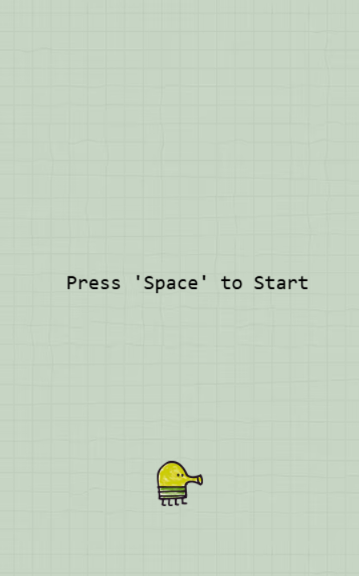
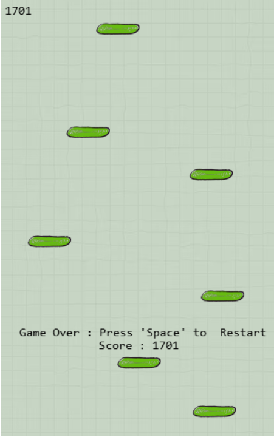

# Dobby Jump

Jump your way up from platform to platform and see how high you can score!

---

## Table of Contents

1. [Overview](#overview)
2. [Demo](#demo)
3. [Features](#features)
4. [Screenshots](#screenshots)
5. [Installation](#installation)
6. [Usage](#usage)
7. [Gameplay](#gameplay)
8. [Controls](#controls)


---

## Overview

"Dobby Jump" is a thrilling jumping game where players leap from platform to platform to reach new heights. Challenge yourself to climb as high as possible while avoiding falls to increase your score.

## Demo


## Features

- Intuitive jumping mechanics
- Dynamic platform generation
- Score tracking based on height reached
- Falling displays final score and allows restart
- Responsive gameplay with smooth animations

## Screenshots




## Installation

```bash
# Example installation steps
git clone https://github.com/HARD1Kk/Dobby-Jump.git
cd your-repository
npm install
npm start
## Usage
```
To play "Dobby Jump," follow these steps:

1. Press **Space** to start the game.
2. Use **Left Arrow Key** or **A** to move left.
3. Use **Right Arrow Key** or **D** to move right.
4. Avoid falling off the screen to keep climbing higher.
5. When you fall, your final score will be displayed. Press **Space** to restart.

## Gameplay

In "Dobby Jump," the goal is to ascend as high as possible by jumping from platform to platform. Each successful jump increases your score. Falling off the screen ends the game and displays your final score.

## Controls

- **Left Arrow Key** or **A**: Move left
- **Right Arrow Key** or **D**: Move right
- **Space**: start/restart the game

